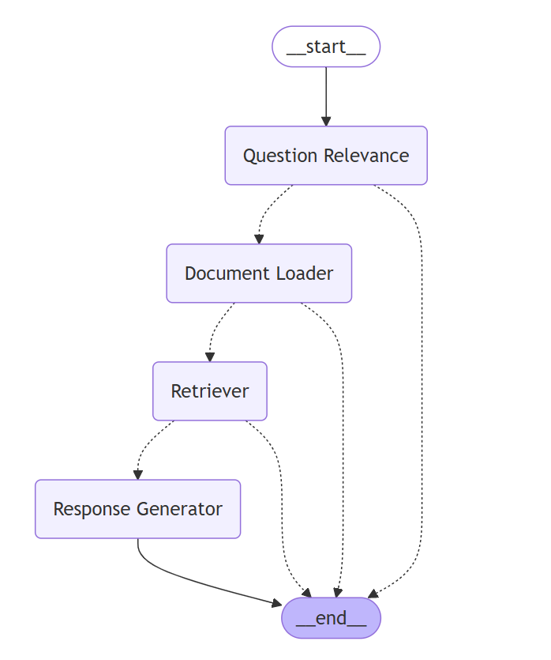
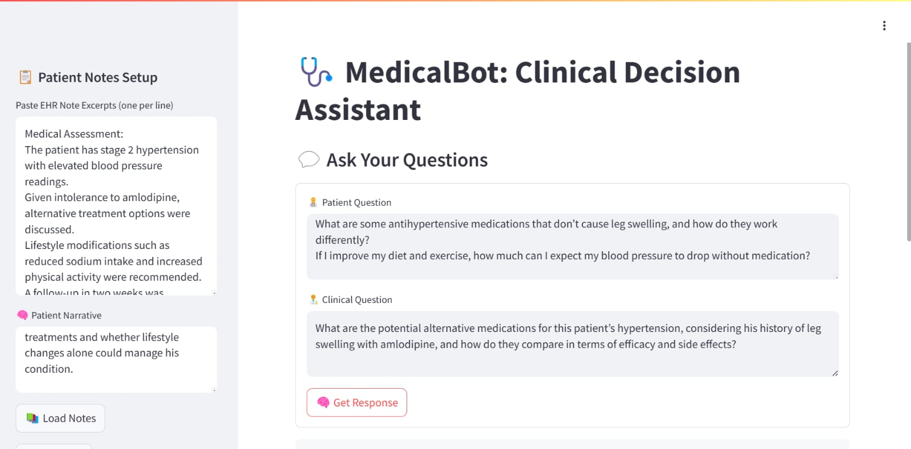
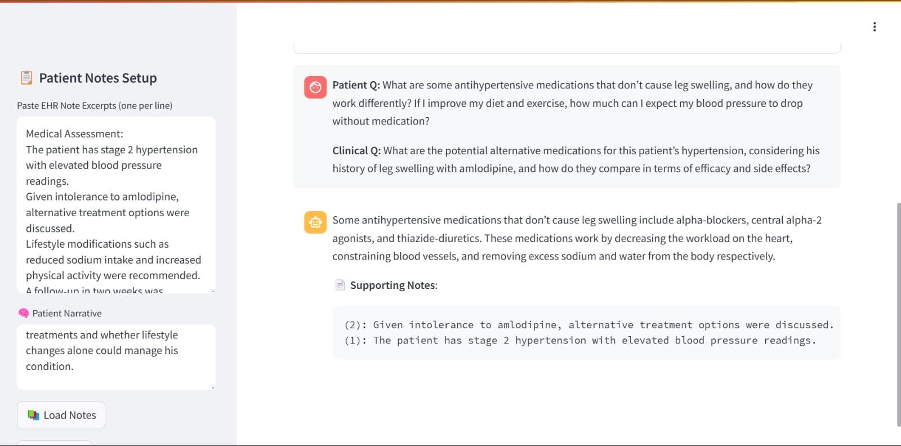

# ArchEHR-RAG

## Overview
This project focuses on automatically generating responses to patients' health-related questions using evidence from their clinical notes. The dataset comprises realistic patient inquiries submitted through a patient portal and their corresponding clinician-rewritten versions, designed to aid in formulating accurate responses. The primary objective is to construct well-grounded, coherent answers that leverage the provided clinical note excerpts to ensure reliable and contextually appropriate information. The pipeline consists of data preprocessing, embedding storage, retrieval, and response generation using a large language model (LLM).

## Team Members
- **R Adarsh - 12141350**
- **M Jashraj - 12141110** 
- **R Chiranjeevi Srinivas - 12141290** 

## Project Structure

```
ArchEHR-RAG/
│── data_processing/   
│   └── preprocess.ipynb  # Converts dataset into a pandas DataFrame for accessibility
│
│── experiments/
│   └── model_experiments.ipynb  # Tests embedding models and retrievers
│   └── question_relevance_sim.py # Experiment on question relevance with similarity score
│
│── main.py  # Main execution script
│── config.py  # Configuration file containing model settings
│── utils.py  # Utility functions for embedding models and LLM initialization
│── question_relevance.py # Implements the question relevance for given inputs
│── vector_db.py  # Manages vector storage using ChromaDB
│── retriever.py  # Implements different retrieval mechanisms
│── response_generator.py  # Handles LLM-based response synthesis
│── app.py # Streamlit web interface for Medical Bot.
│── requirements.txt  # Dependencies
└── sample_data.json # Contains sample test cases (synthetic)
```

## Technologies and Models Used
- **Embedding Models**: `mpnet`, `minilm`, `distilroberta`, `MedEmbed`, `BAAI_bge`, `MiniLM`, `GTE_base` (defined in `config.py`)
- **Retrievers**: `Base`, `AutoMerging`, `BM25`
- **Database**: `ChromaDB`
- **LLM**: `ahmgam/medllama3-v20` (Ollama model), `deepseek-r1` (OpenRouterAPI)
- **Libraries**: `llama-index`, `langchain`, `langgraph`, `chromadb`, `fastembed`, `streamlit`

## Input Format (Example)
Input query format for the system:
```json
{
    "patient_narrative": "The patient is a 56-year-old male with a history of type 2 diabetes and hypertension. He presented with recurrent headaches, dizziness, and occasional episodes of blurry vision over the past two months. His blood pressure at the clinic visit was 162/98 mmHg. He was previously on amlodipine but stopped taking it due to leg swelling. The patient is concerned about alternative treatments and whether lifestyle changes alone could manage his condition.",
    "note_excerpts": {
        "0": "Medical Assessment:",
        "1": "The patient has stage 2 hypertension with elevated blood pressure readings.", 
        "2": "Given intolerance to amlodipine, alternative treatment options were discussed.", 
        "3": "Lifestyle modifications such as reduced sodium intake and increased physical activity were recommended.",
        "4": "A follow-up in two weeks was scheduled to reassess blood pressure response to the new treatment.",
    },
    "patient_question": {
        "0": "What are some antihypertensive medications that don’t cause leg swelling, and how do they work differently?",
        "1": "If I improve my diet and exercise, how much can I expect my blood pressure to drop without medication?"
    },
    "clinical_question": "What are the potential alternative medications for this patient’s hypertension, considering his history of leg swelling with amlodipine, and how do they compare in terms of efficacy and side effects?",
}

```

## How to Run the Project
### 1. Clone the repository:
```sh
git clone https://github.com/chiru-13/ArchEHR-RAG.git
```
```sh
cd ArchEHR-RAG
```

### 2. Create a Virtual Environment
- For Ubuntu
    ```sh
    python -m venv venv
    source venv/bin/activate
    ```
- For Windows
    ```sh
    python -m venv venv
    venv\Scripts\activate
    ```

### 3. Install Dependencies
```sh
pip install -r requirements.txt
```

### 4. Download Ollama Model
#### Ensure that `ollama` is installed. If not run the below commands in the terminal:
- For Ubuntu
    ```sh
    curl https://ollama.ai/install.sh | sh
    ```
    ```sh
    ollama serve &
    ```
    
- For Windows
    * Download the Ollama desktop app from [https://ollama.com/download/windows](https://ollama.com/download/windows)

#### Then pull the required model:
```sh
ollama pull ahmgam/medllama3-v20
```
### 5. Get OpenRouter API Key (for DeepSeek Model)
- Go to [openrouter.ai](https://openrouter.ai/deepseek/deepseek-r1:free)
- Sign up or log in.
- Navigate to the **API Keys** section.
- Generate a new API key.
- Save this key securely and configure it in `config.py` in the variable `OPENROUTER_API_KEY`.

### 6. Running the Project

- **Option 1: Run through Command Line Interface (CLI)**
    ```sh
    python main.py
    ```

- **Option 2: Run through Web Interface (Recommended)**
    ```sh
    streamlit run app.py
    ```

    This will launch a web application where you can input:
    - Clinical notes
    - Patient narratives
    - Patient questions
    - Clinical questions

    and get the generated responses directly via an easy-to-use interface.


## Workflow Visualization
### The workflow of the project can be visualized as follows:

<p align='center'>

</p>

## Streamlit App Interface 
<p align='center'>

</p>

<p align='center'>

</p>

## File Descriptions

### `main.py`
The main entry point of the project, orchestrating data loading, retrieval, and response generation. It initializes components such as the retriever, embedding models, vector database, and LLM, then processes user queries to generate responses.

### `config.py`
Contains configuration settings, including the selected LLM model (`ahmgam/medllama3-v20`), prompt templates, and embedding models used in the project.

### `question_relevance.py`
Defines the function to perform the question relevance using LLM. It uses the `deepseek-r1` model (OpenRouterAPI) to perform the relevance task with the inputs patient_narrative, patient_question and clinical note.

### `response_generator.py`
Defines functions for generating responses using the selected LLM. It creates a response synthesizer using `llama_index` and constructs a query engine by integrating a retriever and a response synthesizer.

### `retriever.py`
Implements different retrieval mechanisms to fetch relevant information:
- **Base retriever**: Retrieves documents based on vector similarity.
- **AutoMerging retriever**: Enhances retrieval by merging relevant document chunks.
- **BM25 retriever**: Uses a traditional term-based ranking algorithm for retrieval.

### `utils.py`
Contains utility functions:
- **Embedding model loader**: Loads embedding models based on the configuration.
- **Document and node creation**: Converts input text into structured nodes for indexing.
- **LLM initialization**: Loads and configures the LLM model (Ollama) for response generation.

### `vector_db.py`
Handles vector storage using ChromaDB. It initializes a persistent ChromaDB client, creates vector indexes for documents, and manages retrieval operations.

### `data_processing/preprocess.ipynb`
Prepares the dataset by converting it into a Pandas DataFrame for easy accessibility and readability before embedding and retrieval.

### `experiments/model_experiments.ipynb`
Used to test different embedding models and retrievers before finalizing the workflow. This notebook ensures the best-performing configurations are selected.

### `experiments/question_relevance_sim.py`
Experiments various inputs to check the similarity scores that can be used to achieve the task of question relevane among the inputs.

### `app.py`
Creates a Streamlit web interface for users to input clinical notes, patient narratives, patient questions, and clinical questions and get the desired response for the question.

### `sample_data.json`
Contains the sample test data for testing the work flow of the `ArchEHR-RAG`. Load this json or copy paste each test case as required to `main.py`.

## Citation for ArchEHR-QA:
Soni, S., & Demner-Fushman, D. (2025). ArchEHR-QA: BioNLP at ACL 2025 Shared Task on Grounded Electronic Health Record Question Answering (version 1.1). PhysioNet. https://doi.org/10.13026/f9xr-rr81.

## Citation for PhysioNet:
Goldberger, A. L., Amaral, L. A. N., Glass, L., Hausdorff, J. M., Ivanov, P. C., Mark, R. G., Mietus, J. E., Moody, G. B., Peng, C.-K., & Stanley, H. E. (2000). PhysioBank, PhysioToolkit, and PhysioNet: Components of a new research resource for complex physiologic signals. Circulation, 101(23), e215–e220. https://doi.org/10.1161/01.CIR.101.23.e215.
